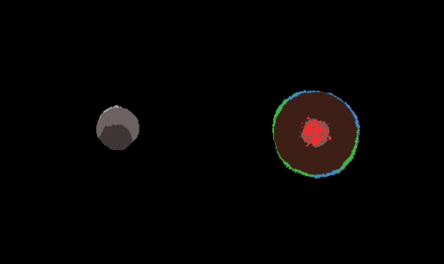
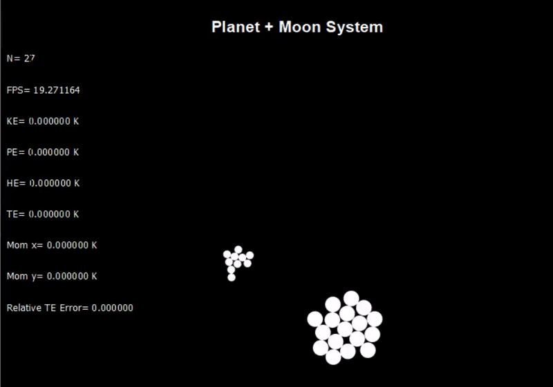
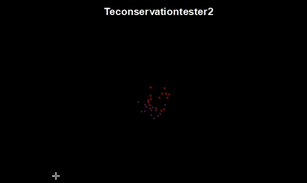
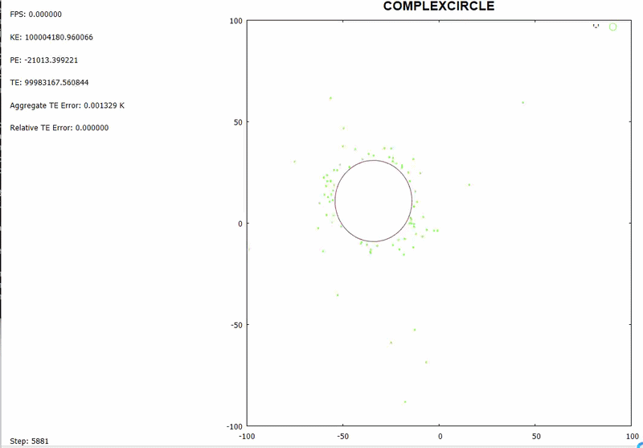
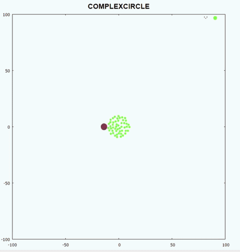
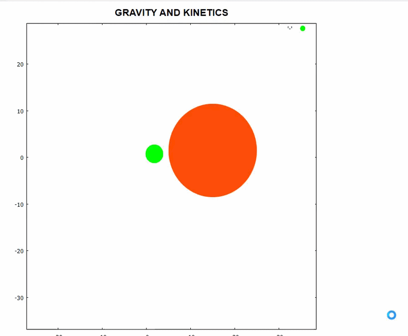

## DevNotes

### Notes (12/03/2026)
Added some more gifs to old notes to show better evolution of the project over time. Migrated the Devnotes to a separate file as it is optional literature. 

### Notes (11/03/2026)
This change focusses on building of planets and moons. Objects can now be saved down by the user and edited (this is so far limited to positions, velocities and rotation only). This allows e.g. a moon to be generated by the user and afterwards loaded into any more complex scenario. A major issue is that objects were saved with strongly overlapping particles present in them (as overlap correction does not provide geometric correction, but adds velocity impulses which slowly fix the overlap). To fix this, at the end of simulation overlaps are corrected for by geometrically shifting particles away from the centre of mass, until either too many iterations are reached, the worst overlap goes below a user defined threshold or there is no further improvement measured by cumulative overlap of the system for x iterations. This is computationaly O(n^2) and not optimized, so the user can disable this if an object does not need saving. Building objects is somewhat tedious, as e.g. a core can be generated, and then a new simulation generates outer layers of a planet, but some trial and error is needed to set appropriate dt, beta parameter (overlap correction strength), overlap tolerance threshold etcetera.

A minor update was made to the particle brightening when heated up so its less sensitive to outliers.

proofofconcept09-03-26.gif shows the capacity of the code after these changes. 

#### Next steps (11/03/2026):
-Provide further capstone use cases to demonstrate the projects abilities to its fullest
-Clean up readme: at minimum all project files are to be properly discussed, a basic user guide on how to use the code (parameter choices mainly), an overview of lessons learned in the entire project and suggestions for future directions to be taken (Either for a ParticleSimulator3, or if anyone is interested building on top of the code).
-Figure out if I can make this a nice clean release

### Notes (01/03/26)
Analysis showed that in the naive algorithm gravity calculation accounted for about 60% of computation time with 30% going collission handling and the remainder to some overhead. Following reworking the code, Barnes-Hut approximation algorithm was implemented for gravity, after some reworking of the velocity verlet integration to ensure its compatible. Furthermore, collission handling benefits from the quadtree generated for BH as well, as it is used as a spatial grid which is used to limit the amount of collission checks that need to happen to the square of the concerned particle and surrounding squares. This was shown to be effective, with collission checks that resulted in a collission found for a test case increasing from 0.2% to 8%. Overall, there seems to be a relatively modest gain in computational speed for test case with 10k particles (around 30%), but likely this benefit becomes much higher with particle count higher than that.

Following BH implementation, I was able to increase the simulation sizes, which created two new problems 
1) Memory overflow and code crashing: Particle states were added for each timestep which created huge objects in memory. To resolve this, a cache system was implemented which would write to a cache every n steps and release the memory. This was effective as the code does not crash anymore for particles <75k. Furthermore, in case the code crashes, cache can easily be restored so progress is not lost. To ensure cache sizes don't rise to be prohibitive, a parameter is set to only save 1/m states to the cache. 
2) Particle Rendering: Even though simulation and plotting steps are separate, GNUplot struggled with rendering more than a few thousand particles per second, thereby frame rate was too low to give a dynamic video. The solution is to separate rendering and playback. Now, GNUplot generates one frame and then saves it to a .gif. A user customizable parameter can make the rendering less granular to speed up. For a large simulation, rendering takes about 10% of the time of simulation, which is more than ideal, but I can tolerate it.

Besides the above, some minor refactoring was done to make the logging more intuitive and the camera is now oriented based on the center of mass. To illustrate capacity of the code at current stage, see the gif below:

### Notes (19/02/26)

Implemented a barnes hut algorithm for gravity and used the same quadtree for pruning collission checks. See other branche.

Barnes Hut seems to give a decent speed up but error does approach threshold of 1% which I ideally want to stay below. Pruning is highly beneficial as previously 0.2% of checks resulted in a collission, compared to 7% for the validation set now.

Due to the increased efficiency, larger simulations are now possible, which lead to unexpected code crashes. My guess would be that I keep appending particle states to the same object in memory until my RAM is insufficient. To fix this, a cache system has been implemented that saves the computed frames regularly. this has two benefits: 1) frees up RAM and avoids crashes, 2) if there is a crash/manually stopped the programme simply re-running it will pick up at last cached step.

Work ahead is to slightly better optimize the BH and quadtree pruning set up, allow for parameters to be user accessible and clean up the cache system introduced (which is very messy at present).

### Notes (14/02/26)
This branch will focus on the implementation of Barnes-Hut approximation algorithm to reduce the complexity from O(n^2) to O(nlogn). Any results are to be carefully validated against BH_validationset scenario to evaluate speedup and error between the baseline and a BH quadtree. Proper logging of time and energy is set up to make this process more rigorous

Wikipedia has an excellent overview of Barnes-Hut (https://en.wikipedia.org/wiki/Barnes%E2%80%93Hut_simulation)
The below gif gives a pretty good idea (taken from wiki) of the algorithm. In essence, for each particle, the gravitational interaction will be measured not against all other particles but against quadrants, with each quadrant having a aggregated center of mass (mass & location), and closer by quadrants being smaller than far away ones. 

### Notes (08/02/26)
Performance of the simulation is sped up 5000 times, which well exceeds the 5 times goal I set. Further simulation optimization would need to implement a quadtree and/or spatial grid for collission detection, which is the last goal I set at the beginning, so that's exciting. The biggest time save is to make debugging (e.g. calculation of momentum, energy) user toggleable with a flag instead of the default, second biggest being conversion of high_prec back to double (turns out having 1e-16 is sufficient accuracy) and third better usage of pointers. Some more minor but still significant time savings were made by removing redundant operations and reducing redeclaring variables which did not serve a purpose.

This allows some more complex simulations. For evidence, see proofofconcept01-02-2026.gif

Some secondary changes
* RGB assignment is reworked. Now it should give more apparant heating visuals as is shown in the POC. Choosing the right parameters for most appealing/informative visual seems to be more of an art.
* Due to n>1k, GNUPlotter was struggling with visualisation. Plotter is now made more efficient and can skip frames in a more customizable way. Still slightly jittery plotting, but this has no bearing on the actual simulated events so is not a priority as of now.

Lessons learned:
* Some time (2.5h) was lost on git versioning problems. Lesson learned is to always keep sufficient additional backups and when a problem arrises on git, to not deprioritize in favour of more interesting work.
* Each run has a different execution time, and even with 6 runs, there is still a considerable variation due to other processes running/clocking times. A robust approach would need to test each change multiple times and have a null-hypothesis of there not being a significant improvement. Only when this hypothesis can be rejected should the change be kept.
For measurement of computational gains for which 10x speed ups are expected, a robust approach is not needed and can be eye-balled. For expected gains of 1.5x speedups, it is sufficient to take the average time of a handful of runs (say 6). Where optimizations of 1.2x or less are under consideration, a robust and standardized approach would be necessary. Using the above rules of thumb, I only kept optimizations that gave >1.5x improvements.

### Notes (01/02/26)
Following much headaches the physics engine now is able to run simulations based on inelastic collissions with a moderate complexity (n=60). Looking back on my C++ journey, I have started the initial work on ParticleSimulator1 (which was limited to kinetic interactions and ignored gravity) 1 year and 10 months ago. Reflecting back on this, I would say that I did learn basic C++ concept more towards the beginning of the project, but learning shifted almost completely away from this in the last year, towards grasping of geometry, basic physics principles and a bit of visual/game development. As an example, initially I had to engage on broad goals, plotting of particles, reading of input files, separation in header/source files etc, while more recently I focussed exclusively on different ways to deal with overlap resolution. Both are good learning, but in the next stage of the project (see below in next steps) I will work on computational efficiency, which should bring me back to the computer science/C++ side of learning. Below I will discuss in order 1) recap of the inelastic issue and eventual fix, 2) lessons learned, 3) Next steps.

1) Gravity in each time step will attract particles. For perfectly elastic collissions, each overlap corresponds with an immediate rebounce, hence naive overlap corrections were fine. For imperfectly elastic particles however, this rebounce doesn't happen, hence overlaps will occur in each timesteps and hence any errors introduced by overlap corrections explode over time. I struggled months with how to properly handling overlap correction, with the constraint that any correction needs to respect the conservation of energy. The ultimate solution is to not separate overlap resolution and collission resolution, and simply handle overlap resolution as part of collissions. The core change to do so is when two particles overlap, to introduce an extra outwards velocity component which is larger depending on the size of the overlap. The drawback is that a parameter is to be selected on how strong this bias is. A too large bias seems to give visual appearance of elasticity (which shouldnt be for inelastic particles), while a too small one leads to overlaps growing larger. 0.5 seems to be a good value balancing both for a range of mass values (more mass is more gravity, hence requiring a higher parameter). As a result, benchmark simulations for perfectly inelastic particles now have energy errors well under 1%, which means this topic is closed off. See for a proof of the results the file in this branche: proofofconcept01-02-26.gif.

Looking back at it, there are 3 components leading to this happy (though dragged out) resolution: 1) introduction of a clear benchmark and for each change testing again against this benchmark. This avoids solving one problem and creating 2 new ones, which especially in AI assisted programming is an endemic issue 2) I first encountered this issue exactly one year ago, hence AI has improved significantly. 3) I worked with 2 different freelancers through Fiverr (more on that below), which while it provided mixed results allowed some mistakes to float up and be fixed. 

2) Lessons Learned:

As I realised the time commitment combined with the little progress over the last year was starting to drag on me, I decided to look for a freelancer on Fiverr platform. This gave mixed results, but overall I think it was a valuable experience (hired help twice). Success is fully defined by how good instructions are and its not always easy to come up with a clear statement of work. For an overview of my approach in managing Fiverr Freelancers, See the readme on https://github.com/Braumeister-Stefan/ParticleSimulator2/tree/Fiverr_branch2 and the statements of work (SOW) on that branch for phase 1 & 2.

After working on and off for the last 4 months on this project, I managed to get inelastic collissions working, so that particles behave in a physically realistic way (clumping together while retaining linear and angular momentum) and converting KE to heat, which shows visually as particles brightening. An issue I was not able to solve is that seemingly, energy is created from nothing. I will take a break (though not abandon just yet) from this project to focus on my mathematics learning (MST125 at Open University) and perhaps start another python/c++ sideproject. 

Looking back, I spent hundreds of hours on this project, which gave me a lot of learning but I should be aware of the opportunity costs as well. A weekend spent on (a small fraction of) this project means a weekend I can't develop something else, work on my health or follow a course.

#### Next Steps (01/02/26)

Major:
* 3 benchmarks "Planet + Moon System" has been created for different simulation lengths, ranging from 5 hours to 2 minutes and stored for each energy error and runtime in a benchmark. As I am comfortable with the Physics being correct, next I want to get rid of any efficiencies in the code that slow down the simulation, measuring for each change improvements in runtime (and ensure no new energy errors are introduced!). As I was not at all focussed on computational efficiency in my own work, prompts to AI and Fiverr collaborations I do expect there should be some low hanging fruits. Definition of success is at least a 80% reduction in computation time. To be scientifically rigourous I should run simulations multiple times to get a stable average simulation time, but at this stage this seems overkill. [DONE, 500,000% improvement, well over target]

Minor:
* Better handling of RGB values. Currently very slow and visually not appealing. In essence, I want to have no change in colour with mild heating and only large heating should give a visual cue. (Think a brown orb, impacted and the particles on the side of impact should become bright/reddish). [DONE]
* Simulation outcomes can now be loaded as objects, which allows iterative construction of more complex objects. This is necessary to create multi-particle objects such as planets, as it is (in my understanding) an unsolved problem in mathematics how many smaller circles fit into a larger one, hence allowing gravity to do its work acts as a numerical solver to this packing problem. A change that would make this more useful is if I can edit the (system) velocities & positions of these objects in the same interface as for new objects. [DONE]

### Notes (25/1/25)
My best guesses is that the issue of increasing energy is that this has something to do with overlap resolution  An issue I was not able to solve is that seemingly, energy is created from nothing once particles are collided (leading to disintegration of the system). My best guesses is that this has something to do with overlap resolution 
Possible next steps to look into a solution is to investigate why it seems that after some time a 2-body inelastic colliding system seems to converge and not build up additional energy. Another clue is that this convergence seems to happen much later when the timestep is smaller. I would guess that the way I correct for energy difference after geometrically separating particles has issues in the math. Two alternative things to explore is if the issue is numeral inaccuracy (particle structure is still double datatype even though calculations are almost all high_prec datatype) or a wrong order of overlap resolution, collission resolution and verlet integration. (see .PNG for illustration, note the initial drop is expected due to conversion of KE to HE).

### Notes (24/10/24): 
* Lost 2 days of work due to a deleting some files. Managed to recover but teaches the valuable lesson to push small incremental changes to git instead of everything at once.
* Currently able to simulate moderately complex (n=50, 5000 steps) simulations, limited to perfectly elastic conditions though.

* Math and physics needed to understand the current PhysEngine is not very high, but to come up with the right solution required multiple evenings of reading, youtube and use of LLMs.
* Chatgpt-4o is a great tool, but will only provide the elementary building blocks once the problem & solution is clearly described. For future problems, it would be a good idea to take some time drawing out a problem and solution on paper first, before starting to generate code and incrementally improve it.
* Some doubt on whether implementing quadtree method is 1) within scope of my skillset, 2) has sufficient pay off versus simpler efficiency increasing techniques (e.g. only checking for overlaps on nearby particles).
* Some (Arbitrary) threshold on artificial energy needs to be set. I will put it at 1% meaning that simulations that exceed this threshold should not be accepted.
* There will always be a trade-off between precision and computational speed. In case of the high_prec data structure, this is a worthwile tradeoff.

#### Next steps (24/10/24):
* Wrap up some minor points set out above in 29/9.
        * number of particles, fps tracker (technically correct but shifts too fast to see).
        * validation of momentum
        * GUI on 1/3 screen and plot other 2/3 screen. Darkmode (if not too hard)
* Saving of rendered simulations should only save down the 1/dt-th frames to make saving simulations less of a wait.
* Gravitational attraction has a dampening factor (ɛ̝) that prevents division by (near zero). This needs to be made relative to the size of particles so as to allow smaller particles to function properly.
* Inelastic (and partially inelastic) collissions need to be programmed. To my understanding this involves a transfer of kinetic energy to heat which needs to be programmed. Can be strictly visual for now, e.g. adding heat as a Particle property and linearly increasing r,g,b values on the plot based on its value.
* Complex object "SPINNING CLOUD (name is WIP)" to be made, which is same as CIRCLE but with angular momentum. Needs to be tested so that it remains stable (for a certain mass) over time if not affected by external forces. This will allow me to make meaningfull scenarios which should push against the computational bounderies of an O(n2) method. [DONE]

### Notes (29/9/24):

Complex object rendering, Saving and retrieving from cache (conditional on cache param in scenario specified). Support for circle only is fine [DONE] should include manual inputs into complex name groups "with group defined particles are rendered from the same complex object" to allow for easier user input. Satisfies the GUI criteria for the project. [DONE] 4/10: Would be nice to have GUI on 1/3 of screen and plot on 2/3 of screen.
Validation of momentum and kinetic energy conservation
number of particles, fps tracker on the plot handled through the metrics and plotter classes

Issues:
When to use unique_ptr and when to use shared_ptr? I see the logic of pointers giving the benefit of clear memory allocation and deallocation. However, they require complex syntax. I will try to use them in computationally demanding parts of the code, but not simple ones such as reading and writing inputs.

I decided to abandon my goal to use classes instead of structs. Classes seem to differ mostly in access rights and are only usefull when I learn about inheritance and polymorphism. I will stick to structs for now. [Abandoned]

### Notes (25/9/24)
I replicated the basic structure from ParticleSimulator1, though for 2D instead of 3D to simplify things. Proof of a simple gravity & kinetic system below:

Euler integration was inappropriate as it poorly worked with gravitational effects (it did fine for strictly linear kinetic only effects, which is why it was sufficient for ParticleSimulator1. In exchange, velocity verlet (https://en.wikipedia.org/wiki/Verlet_integration#Velocity_Verlet) is implemented, which has the added value of being symplectic, e.g. it has the benefit of time-reversability, a desirable property for physical systems according to the literature.
