# ParticleSimulator2 (2026)
_By Braumeister Stefan (smdw1997@gmail.com)_

## Project description
ParticleSimulator2 is a 2D physics engine that supports Newtonian gravity and collisions for n-body systems. Its complexity is **O(nlogn)** through implementation of the Barnes-Hut approximation algorithm.

Below are some examples of simulations that are possible with this engine. These and more are stored in [Media](Media).

### Planet Formation

<table>
  <tr>
    <td valign="top">
      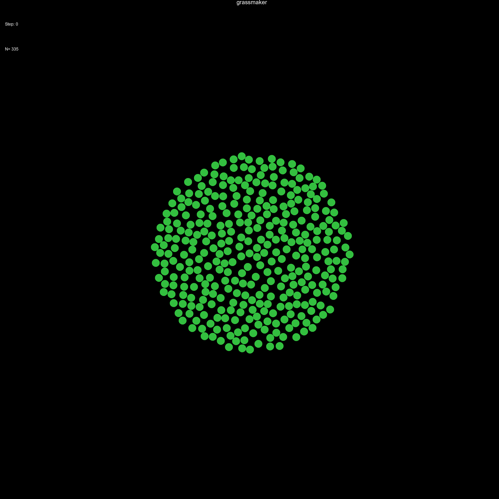<br/>
      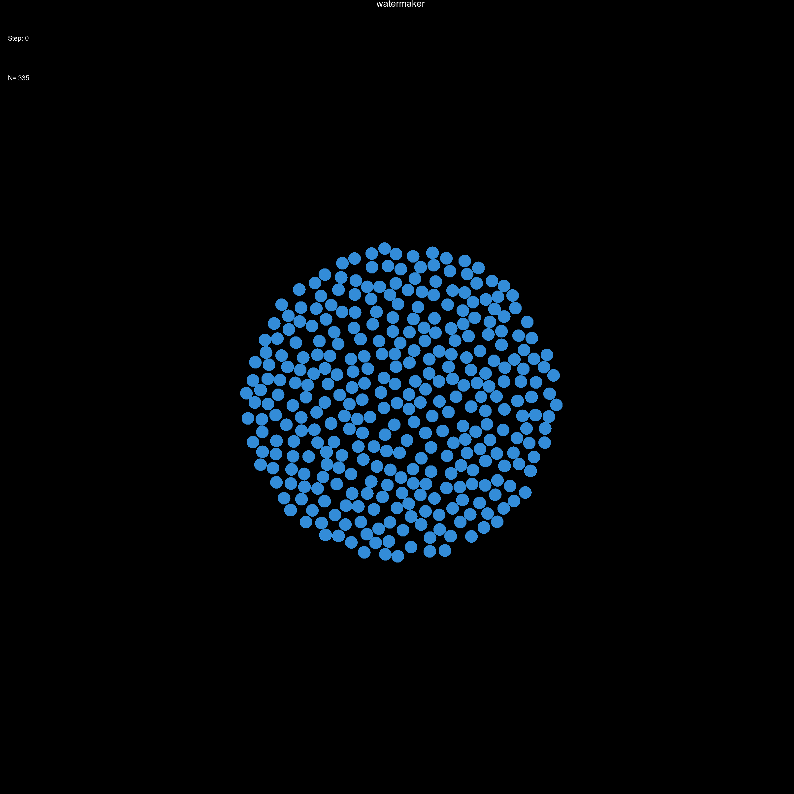
    </td>
    <td align="center">
      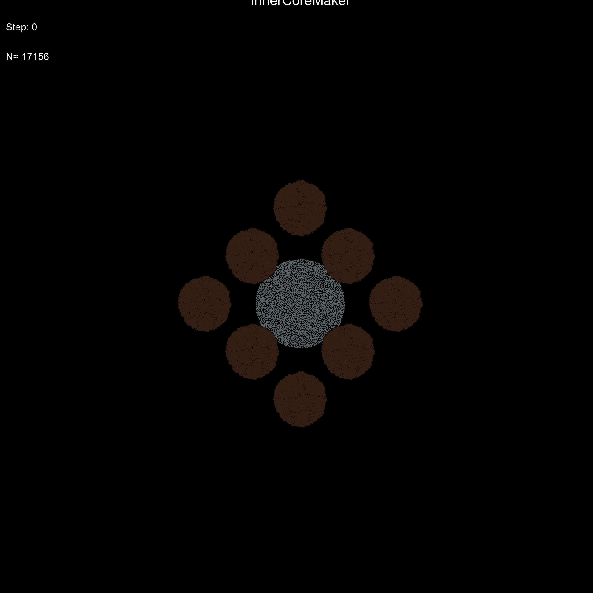
    </td>
    <td align="center">
      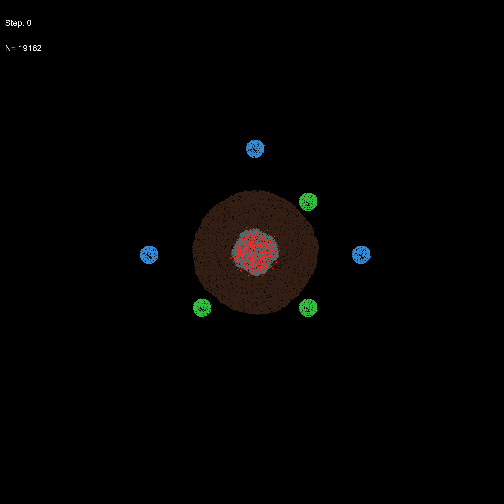
    </td>
  </tr>
</table>

### Simulation of Expanding Hydrogen Cloud 

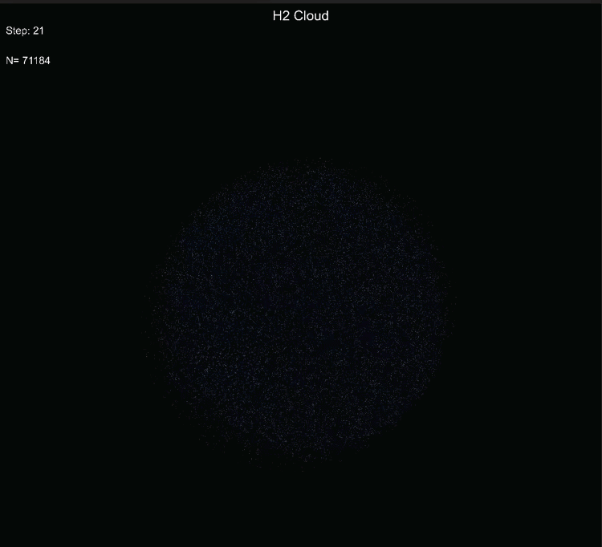

### Impact of a moon and a planet

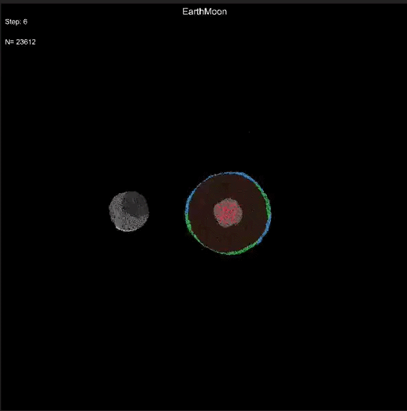

### Stable rotation of a moon around a star

<table>
  <tr>
    <td align="center">
      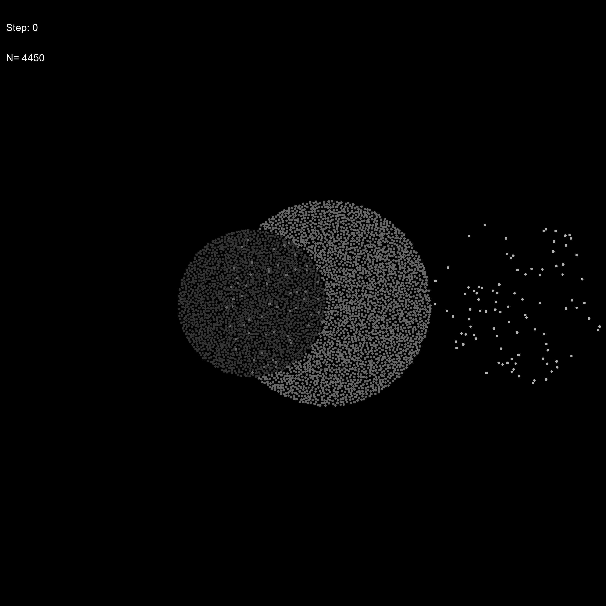
    </td>
    <td align="center">
      
    </td>
  </tr>
</table>


## Objectives
I worked on this project to improve upon the lessons learned from ParticleSimulator1 and build a solid C++ foundation.

Below are the main objectives I set myself to reach before considering the project a success. After 1 year and 8 months, all objectives were reached. I tried to log my learning journey and the project evolution towards these objectives in [DevNotes](DevNotes.md).

### Primary objectives

*	Separate code in header and source files [DONE]
*	Use smart pointers. Each particle should only be defined once. [DONE]
*	Implement a quadtree (store the O(n^n) design for comparison) [DONE]

### Secondary objectives

* Loading of objects/run, user interface to navigate options, using .csv instead of .txt [DONE]
*	Implement a simple helper function that can be wrapped around any function and prints run time to measure efficiency [DONE]
*	Allow for particle radius and particle mass to be individualized [DONE]
*	Separate computation and play-back of simulations [DONE]

## Project structure

*	Main.cpp: This is the main file from which the code runs. This is what you should build locally.

Header files:
* ObjHandler.h : this will contain all functionality in generating, saving and unpacking complex objects
* PhysEngineWrapper.h: this will initialize the simulation, run through the timesteps, measure energy and time differences with benchmark, and handle caching of simulations.
* PhysEngineCore.h: for a given timestep, this file will handle parameter choices, collisions, integration, update particle locations and save Particle information & meta information at the end of the simulation. 
* ParticlePlotter.h: this will set up the plotting engine and plot particles for every timestep, it will also assign RGB values conditional on temperature.
* Interfacer.h: this will read the input parameters, define scenarios and allow the user to choose which scenario to run.
* Particles.h: this will define the individual, grouped and time-variant grouped particles and meta information per timestep. 
* PhysMetrics.h: this will define all functionality related to the validation (Both physics and efficiency related) metrics.
* MathUtils.h: this will some math heavy functions called upon by PhysEngine

All .cpp files will contain the implementation of the above header files.

## User Guide
This section provides a rough guide for those willing to play around with the tool. I believe it could be of use for anyone developing space-based games in c++ or for undergraduate physics/compsci students. Happy to respond to any inquiries over email if there is interest.

### First use

**Prerequisites:** A C++17 compatible compiler (e.g. g++) and [GNUplot](http://www.gnuplot.info/) installed and available on your PATH.

1. Clone or download the repository
2. Compile from the project root using g++ with C++17:
   ```
   g++ -std=c++17 -O -g -o ParticleSimulator.exe Main.cpp Model/Model.cpp Model/src/Interfacer.cpp Model/src/MathUtils.cpp Model/src/objHandler.cpp Model/src/ParticlePlotter.cpp Model/src/PhysEngineCore.cpp Model/src/PhysEngineWrapper.cpp Model/src/PhysMetrics.cpp -I Model/include
   ```
   This is also available as the default build task in VS Code.
3. Run `ParticleSimulator.exe` from the project root directory

### Logging system

All output is logged to the console window from which the executable is run. From there, the user selects which scenario to simulate, receives feedback on common issues (e.g. missing inputs, overlapping particles), and can track simulation progress. Once the GIF is rendered, it can be launched directly from the same console.

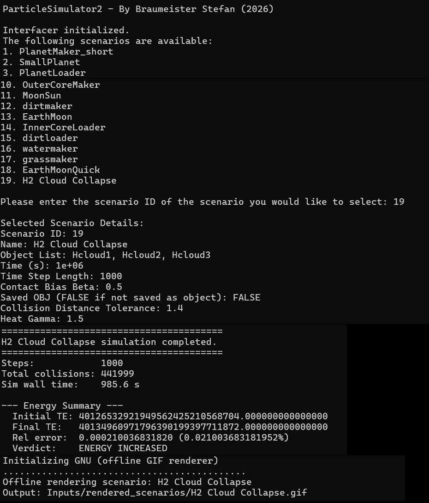

### Main Inputs

All inputs below are accessible through `scenario_inputs.csv` and `object_inputs.csv`, both stored in the `Inputs/` folder. To create a new scenario or object, add a row with your desired values.

#### Scenario Inputs (`scenario_inputs.csv`)

Each row defines a simulation run. Scenarios reference one or more objects by name.

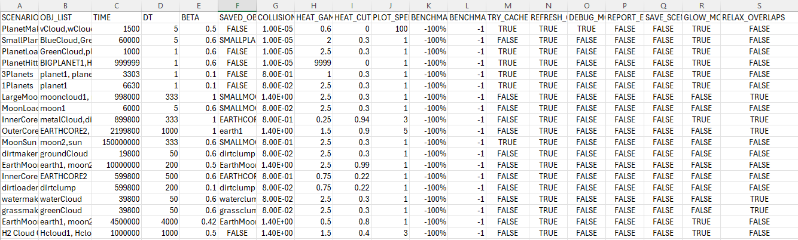

| Parameter | Description |
|-----------|-------------|
| `SCENARIO_NAME` | Name for the scenario |
| `OBJ_LIST` | Comma-separated list of object names to include |
| `TIME` | Total simulation time |
| `DT` | Timestep size — smaller = more accurate, slower |
| `BETA` | Contact bias factor for collision position correction. Increase if simulations blow up, decrease if they appear bouncy |
| `SAVED_OBJ` | Name to save the resulting object as (or `FALSE` to skip) |
| `COLLISION_DIST_TOL` | Distance tolerance for collision detection, a lower tolerance will lead to much slower saving of objects when SAVED_OBJ !FALSE |
| `HEAT_GAMMA` | Gamma function to specify visual heating of particles. 1 means linearly with temperature, >1 means most of brightening happens only for the extremely hot particles |
| `HEAT_CUTOFF_FRAC` | Fraction below which heating does not show brightening. Set to 0 to ignore its effect |
| `PLOT_SPEED_MULTIPLIER` | Playback speed multiplier for visualization. Noticeable effect on rendering speed for larger simulations. |
| `BENCHMARK_TE_ERROR_PCT` | Expected total energy error % for benchmarking |
| `BENCHMARK_SIM_TIME_SEC` | Expected wall-clock time in seconds for benchmarking |
| `TRY_CACHE` | `TRUE` to load/save simulation cache from disk |
| `REFRESH_OBJ` | `TRUE` to re-read objects from CSV. Suggested to leave on TRUE |
| `DEBUG_MODE` | `TRUE` to enable step-by-step debug output. This will slow the code down a lot. |
| `REPORT_ENERGY_PER_STEP` | `TRUE` to log energy metrics every step. Only has effect if in DEBUG_MODE |
| `SAVE_SCENARIO` | `TRUE` to save the rendered scenario for reuse |
| `GLOW_MODE` | `TRUE` to color particles by temperature (heat glow) |
| `RELAX_OVERLAPS` | `TRUE` to geometrically move particles away from strong overlaps. Computationally intensive. Increase `COLLISION_DIST_TOL` to speed up, or disable in case there is no need to save an object for future use |

#### Object Inputs (`object_inputs.csv`)

Each row defines an object — either a primitive (e.g. `SIMPLE`, `CIRCLE`) or a reference to a previously saved object.

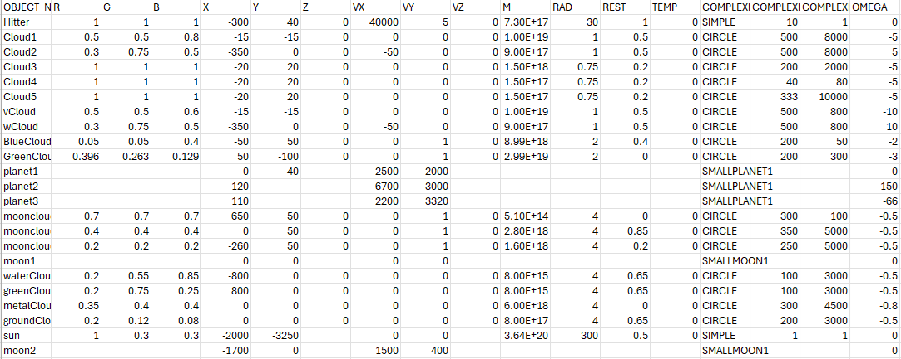

| Parameter | Description |
|-----------|-------------|
| `OBJECT_NAME` | Name for the object |
| `R`, `G`, `B` | Base RGB color (0–1 range) |
| `X`, `Y` | Initial position of the object center |
| `VX`, `VY` | Initial velocity components |
| `M` | Total mass of the object. When two particles overlap, the particle with lowest mass is removed |
| `RAD` | Radius of individual particles |
| `REST` | Coefficient of restitution (0 = rubber-like/inelastic, 1 = clay-like/elastic) |
| `TEMP` | Initial temperature |
| `COMPLEXITY` | Shape type: `SIMPLE` (single particle), `CIRCLE` (disk), or a saved object name |
| `COMPLEXITY_SIZE` | Radius of the generated shape |
| `COMPLEXITY_N` | Maximum number of particles to generate. Actually simulated particles also depend on radius and overlap with other objects. |
| `OMEGA` | Angular velocity (rotation speed of the object). Note that this scales as particles are further away from the center |

> **Tip:** Leave fields blank to inherit defaults from a referenced saved object. See existing entries for examples.
>
> **Tip:** When creating a new object, start with a simple shape (e.g. `CIRCLE`) and save it as a new object. Then you can reference that object in future scenarios or use it as a building block for more complex shapes.

### Outputs

The simulation produces two types of output:

- **Scenario CSV** — a full dump of all particle states across all timesteps. These files are typically too large to open in Excel and should be explored using the Python scripts provided in `Python Diagnostics/`.
- **GIF** — an animated visualization of the simulation, rendered via GNUplot.

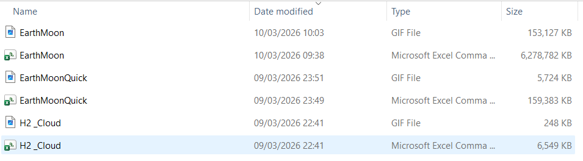

### Further Inputs

The parameters below are hardcoded in the source and can only be changed by editing the code. Recommended for users wishing to extend or fine-tune the engine.

#### Physics Constants

| Parameter | Value | File | Description |
|-----------|-------|------|-------------|
| `kGravitySofteningEps` | `1e-6` | `PhysEngineCore.cpp` | Softening epsilon in gravity force (prevents singularities) |
| `kEnergySofteningEps` | `1e-3` | `PhysEngineCore.cpp` | Softening epsilon for potential energy calculation |
| `kContactBiasSlop` | `0.0` | `PhysEngineCore.cpp` | Penetration tolerance before position bias correction |

#### Barnes-Hut Algorithm

| Parameter | Value | File | Description |
|-----------|-------|------|-------------|
| `kBHTheta` | `0.9` | `PhysEngineCore.cpp` | Opening angle — lower = more accurate, slower |
| `kBHMinHalf` | `1e-8` | `PhysEngineCore.cpp` | Minimum cell size before tree stops subdividing |
| `kBHBoundsPad` | `1e-9` | `PhysEngineCore.cpp` | Padding on root bounding box, relevant for overlap handling |

#### Caching & Output

| Parameter | Value | File | Description |
|-----------|-------|------|-------------|
| `kCacheWriteEveryN` | `50` | `PhysEngineWrapper.cpp` | Only save every Nth snapshot to cache |
| `kCacheFlushEverySteps` | `1000` | `PhysEngineWrapper.cpp` | Flush cache to disk every N simulation steps |
| `kStepPauseInterval` | `100` | `PhysEngineWrapper.cpp` | In debug mode, pause for input every N steps |

#### Rendering (GNUplot GIF)

| Parameter | Value | File | Description |
|-----------|-------|------|-------------|
| GIF resolution | `6144×6144` | `ParticlePlotter.cpp` | Output GIF dimensions in pixels |
| GIF frame delay | `4` | `ParticlePlotter.cpp` | Animation frame delay |
| Plot padding | `0.1125` | `ParticlePlotter.h` | Fractional padding around particle bounds |
| Radial percentile | `0.95` | `ParticlePlotter.cpp` | Percentile of particle distances used for plot bounds |

#### Heat Glow Processing

| Parameter | Value | File | Description |
|-----------|-------|------|-------------|
| Outlier fractions | `0.005` | `PhysEngineWrapper.cpp` | Top/bottom 0.5% of temperatures excluded from normalization |
| Brightness boost | `0.25` | `PhysEngineWrapper.cpp` | Extra brightness multiplier per channel |
| Min-temp threshold | `1e-5` | `PhysEngineWrapper.cpp` | Skip heat tinting if max temperature is below this |

#### Overlap Relaxation (Relevant for saving down complex objects)

| Parameter | Value | File | Description |
|-----------|-------|------|-------------|
| `relaxation_factor` | `0.4` | `objHandler.cpp` | Under-relaxation factor for Jacobi positional relaxation |
| `separation_margin` | `1e-10` | `objHandler.h` | Minimum gap left between particles after relaxation |
| `no_improvement_limit` | `10` | `objHandler.cpp` | Stop after N iterations with no overlap improvement |


### Limitations & Warnings
Some important caveats to keep in mind when using the engine:

- This code was developed on Windows, so compatibility with Linux/Mac is not guaranteed.
- Code seems to crash due to memory issues when running >60k particles on an 8GB RAM machine.
- Storage of simulations takes up a lot of disk space. Ensure you have at least 1GB free for every 300 steps with 50k particles.
- Current rendering is based on the dispersion of the initial frame only. This works well for stable or contracting systems, but may not capture the full dynamics of highly dispersive scenarios.
- Temperature can go negative due to the way kinetic energy loss is converted to heat in case of overlap resolutions. This is physically inaccurate, but heating is only used for visualization and does not affect the physics.
- Code tends to be less stable when particle radius is small. User can specify any radius, but a minimum of 2 is recommended.
- The beta parameter will correct for small overlaps, but can still be overwhelmed by increasingly large overlaps due to very massive particles, leading to "explosive" outcomes. If you see this happening, try increasing the beta parameter or reducing the mass of the particles.
- On the other hand, setting the beta parameter too high can lead to bouncy behaviour which does not look physically natural. Values around 0.5 seem to work reasonably well.
- The code is not calibrated to real physical units (beyond the gravitational constant). It should technically be possible to simulate real-world (e.g. what if the moon and Mars collide) scenarios by adjusting the input parameters, but I have not tested this.


